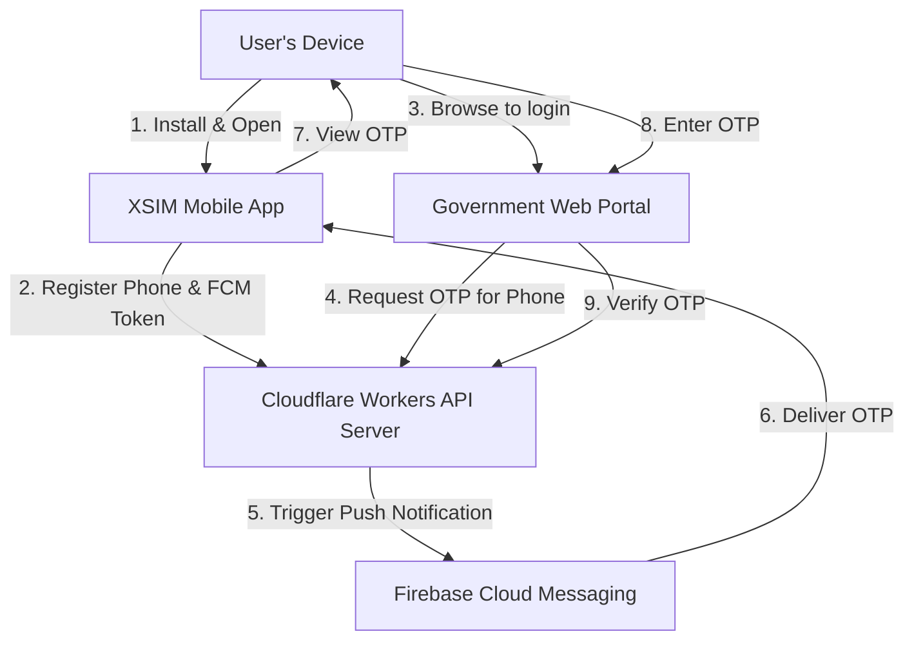

# XSIM Project Flow

This document details the operational flow, architecture, and user journey of the XSIM SIM-based authentication system.

## 1. High-Level Architecture

The XSIM system securely authenticates users via their mobile phone number using SIM-based OTPs, bridging a mobile application and a web portal.

## 2. Component Breakdown

### 📱 Mobile Application (Flutter)
- **Role**: Acts as the physical authenticator device.
- **Key Files**: `app kh/lib/screens/auth_screen.dart`, `app kh/lib/services/notification_service.dart`.
- **Capabilities**: 
  - Retrieves the physical FCM (Firebase Cloud Messaging) token.
  - Registers the user's phone number with the backend.
  - Receives push notifications containing secure OTPs.

### 🌐 Web Portal (HTML/JS/CSS)
- **Role**: The simulated third-party or government service requesting authentication.
- **Key Files**: `web/index.html`, `web/app.js`.
- **Capabilities**:
  - Initiates the login request by asking for a phone number.
  - Polls or waits for the user to input the OTP received on their mobile app.
  - Confirms authentication status with the backend.

### ⚡ Backend API Server (Cloudflare Workers + KV)
- **Role**: The central source of truth for routing OTPs and mapping phone numbers to devices.
- **Key Files**: `server-cf/src/index.js`, `server-cf/wrangler.toml`.
- **Capabilities**:
  - Stores mapping of `Phone Number -> FCM Token` in Cloudflare KV.
  - Handles `/register` (from App), and `/auth/request` & `/auth/verify` (from Web).
  - Integrates securely with the **FCM HTTP v1 API** using JWT signing (Web Crypto API) to send push notifications.

---

## 3. Detailed User Journeys

The XSIM Cambodia App currently supports two distinct demonstration flows, selectable upon launching the app.

### Flow A: App Demo (Original Flow)
*This flow simulates the entire authentication process natively inside the app.*
1. **Login Screen**: User taps "Login with XID".
2. **Phone Number Input**: User inputs their phone number.
3. **Authenticating State**: The app simulates reaching out to the network.
4. **OTP Display**: The app natively displays an OTP to the user.
5. **Success Screen**: The app simulates successful login authorization.

### Flow B: Web Portal Demo (Cross-Device Flow)
*This flow represents the real-world usage where the app acts as an authenticator for a separate web portal.*
1. **App Registration**: 
   - User opens the app, selects "Web Portal Demo".
   - User registers their phone number.
   - App securely sends `(phone_number, fcm_token)` to the `POST /register` endpoint.
2. **Web Portal Initiation**:
   - User goes to `xsim-portal.pages.dev` on a laptop or different screen.
   - User enters the same phone number and clicks "Login".
   - Web portal calls `POST /auth/request`.
3. **OTP Delivery**:
   - Backend looks up the FCM token for the phone number.
   - Backend triggers a Firebase Push Notification containing the 6-digit OTP.
   - The user's mobile device receives the push notification: *"Your XSIM verification code is: 123456"*.
4. **Verification**:
   - User reads the code from the push notification.
   - User enters the code on the Web Portal.
   - Web portal calls `POST /auth/verify`. If successful, the portal grants access to the dashboard.
